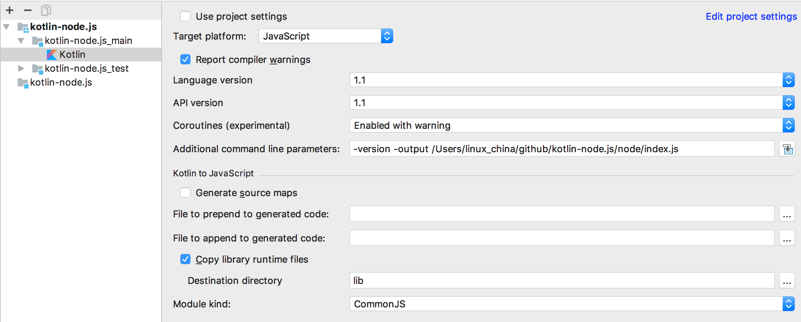

# kotlin-node.js

Code for the article: https://medium.com/@Miqubel/your-first-node-js-app-with-kotlin-30e07baa0bf7#.gr6m4vrvw

### Instructions

1. `npm install` (will install dependencies)
2. `./gradlew build` (will compile Kotlin to JavaScript)
3. `npm start` (this runs `node node/index.js`)
4. Open the browser on http://localhost:3000/

All source code is inside `src/main/kotlin/Main.kt`

### How to Reload after kotlin code compile

please use supervisor to reload js after file changed.
```
npm install supervisor -g
supervisor app.js
```

### Development in IntelliJ IDEA
Please set output absolute path in IntelliJ IDEA.

